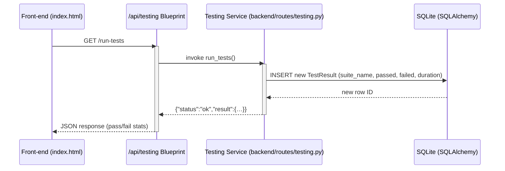

# Sync Bazar – UML Architecture Documentation

The following Mermaid diagrams describe the full architecture of the **Sync Bazar** desktop application.  Paste this file into the repository and view it on GitHub (or any Markdown viewer that supports Mermaid) to see the rendered diagrams.

---

## 1️⃣ Component Diagram – overall system layout
```mermaid
%% Component diagram for Sync Bazar
graph TD
    %% Front‑end
    UI[Frontend: index.html<br/>Tailwind + Alpine.js]
    
    %% Backend Flask app
    FlaskApp[Flask Application (app.py)]
    
    %% Blueprints (modules)
    ProcessBP[Blueprint: process (api/process)]
    GitBP[Blueprint: git (api/git)]
    TestBP[Blueprint: testing (api/testing)]
    
    %% Core extensions
    DB[SQLAlchemy DB (backend/extensions.py)]
    MIG[Flask‑Migrate (backend/extensions.py)]
    LOG[Logging (backend/extensions.py)]
    
    %% Domain models
    ProcessModel[ProcessModel<br/>SQLAlchemy]
    CodeReview[CodeReview<br/>SQLAlchemy]
    SPIRecord[SPIRecord<br/>SQLAlchemy]
    TestResult[TestResult<br/>SQLAlchemy]
    
    %% Exceptions
    Exceptions[Custom Exceptions (backend/exceptions.py)]

    %% Relations
    UI -->|fetch() calls| ProcessBP
    UI -->|fetch() calls| GitBP
    UI -->|fetch() calls| TestBP

    FlaskApp -->|register| ProcessBP
    FlaskApp -->|register| GitBP
    FlaskApp -->|register| TestBP
    FlaskApp -->|uses| DB
    FlaskApp -->|uses| MIG
    FlaskApp -->|uses| LOG
    FlaskApp -->|handles| Exceptions

    ProcessBP -->|CRUD on| ProcessModel
    ProcessBP -->|uses| SPIRecord
    GitBP -->|CRUD on| CodeReview
    TestBP -->|reports| TestResult

    DB -->|stores| ProcessModel
    DB -->|stores| CodeReview
    DB -->|stores| SPIRecord
    DB -->|stores| TestResult
```
---

## 2️⃣ Class Diagram – core data model & extensions
```mermaid
%% Class diagram for core backend
classDiagram
    %% Base configuration classes
    class BaseConfig {
        <<config>>
        +SECRET_KEY: str
        +SQLALCHEMY_TRACK_MODIFICATIONS: bool
        +JSONIFY_PRETTYPRINT_REGULAR: bool
        +CORS_ORIGINS: str
    }
    class DevelopmentConfig {
        <<config>>
        +DEBUG: bool = True
        +ENV: str = "development"
        +SQLALCHEMY_DATABASE_URI: str
    }
    class ProductionConfig {
        <<config>>
        +DEBUG: bool = False
        +ENV: str = "production"
        +SQLALCHEMY_DATABASE_URI: str
    }

    BaseConfig <|-- DevelopmentConfig
    BaseConfig <|-- ProductionConfig

    %% Extensions
    class DB {
        +SQLAlchemy()
        +init_app(app)
    }
    class Migrate {
        +Migrate()
        +init_app(app, db)
    }
    class Logger {
        +basicConfig(...)
    }

    DB --> "1" FlaskApp : used by
    Migrate --> "1" FlaskApp : used by
    Logger --> "1" FlaskApp : used by

    %% Domain models
    class ProcessModel {
        +id: int {PK}
        +name: str
        +maturity_level: int
        +defect_density: float
        +velocity: int
    }
    class CodeReview {
        +id: int {PK}
        +file_name: str
        +code_smells: int
        +status: str
        +comments: str
    }
    class SPIRecord {
        +id: int {PK}
        +process_model_id: int {FK}
        +metric_name: str
        +value: float
    }
    class TestResult {
        +id: int {PK}
        +suite_name: str
        +passed: int
        +failed: int
        +duration_sec: float
    }

    ProcessModel --> "0..*" SPIRecord : 1‑to‑many
    ProcessModel --> "0..*" CodeReview : optional
    ProcessModel --> "0..*" TestResult : optional

    %% Exceptions hierarchy
    class SyncBazarException {
        +message: str
        +status_code: int
        +error_code: str
    }
    class ProcessModelError {
        <<extends>> SyncBazarException
    }
    class GitOperationError {
        <<extends>> SyncBazarException
    }
    class TestingError {
        <<extends>> SyncBazarException
    }

    SyncBazarException <|-- ProcessModelError
    SyncBazarException <|-- GitOperationError
    SyncBazarException <|-- TestingError
```
---

## 3️⃣ Sequence Diagram – “Run Automated Tests” workflow

---

## 4️⃣ Deployment / Packaging Diagram – Desktop vs. Plain Flask
```mermaid
flowchart LR
    subgraph LocalDev["Local Development"]
        direction TB
        A[Flask dev server (Werkzeug)]
        B[FlaskWebGUI (optional)]
    end

    subgraph Desktop["Desktop (Bundled)"]
        direction TB
        C[FlaskWebGUI container]
        D[Embedded Chromium UI]
    end

    subgraph Remote["Remote (GitHub)"]
        direction TB
        R[Git repository]
    end

    %% Relationships
    A -->|run| UI[http://127.0.0.1:5000]
    B -->|launch| UI
    C -->|embeds| UI
    D -->|renders| UI
    UI -->|source code| R
    R -->|clone| LocalDev
    R -->|clone| Desktop
```
---

## 5️⃣ Refined Component Diagram – arrows meet box edges (as requested)
```mermaid
%% Component diagram – arrows meet the edge of each box
graph LR
    %% ----- Nodes (boxes) -----
    subgraph Client["Client (Desktop UI)"]
        direction TB
        UI[UI<br/>Tailwind + Alpine.js<br/>index.html]
    end

    subgraph Server["Server (Flask)"]
        direction TB
        FlaskApp[Flask Application<br/>app.py]
        ProcessBP[Blueprint: Process<br/>/api/process]
        GitBP[Blueprint: Git<br/>/api/git]
        TestBP[Blueprint: Testing<br/>/api/testing]
        DB[SQLAlchemy DB<br/>SQLite file]
        Logger[Logging<br/>sync_bazar_debug.log]
    end

    %% ----- Relationships (arrows) -----
    UI -->|fetch() REST calls| ProcessBP
    UI -->|fetch() REST calls| GitBP
    UI -->|fetch() REST calls| TestBP

    FlaskApp -->|registers| ProcessBP
    FlaskApp -->|registers| GitBP
    FlaskApp -->|registers| TestBP

    FlaskApp -->|uses| DB
    FlaskApp -->|uses| Logger

    ProcessBP -->|CRUD on| DB
    GitBP -->|CRUD on| DB
    TestBP -->|CRUD on| DB

    %% ----- Styling (optional) -----
    classDef box fill:#f9f9f9,stroke:#333,stroke-width:1.5px,rx:6,ry:6;
    class UI,FlaskApp,ProcessBP,GitBP,TestBP,DB,Logger box;
```
---

*All diagrams are kept in Mermaid syntax so they render automatically on GitHub.*
