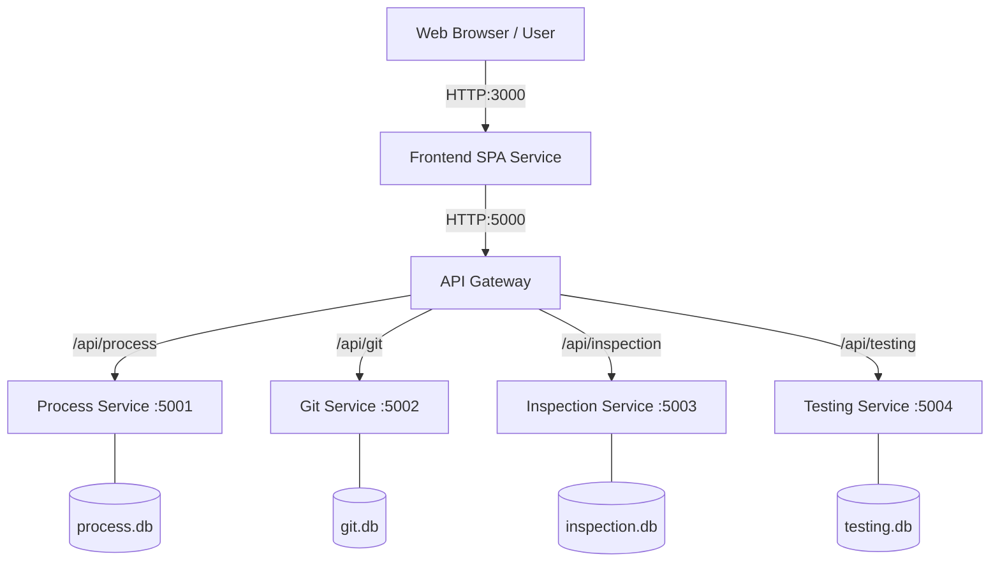

# Architecture Overview

The `desktop-app-sync-bazaar` has been successfully refactored from a monolithic application into a highly scalable, distributed microservices architecture. 

## High-Level Architecture

The system is now composed of 6 distinct containers, orchestrated via Docker Compose:

```mermaid
graph TD
    Client[Web Browser / User] -->|HTTP:3000| Frontend[Frontend SPA Service]
    Frontend -->|HTTP:5000| Gateway[API Gateway]
    
    Gateway -->|/api/process| Process[Process Service :5001]
    Gateway -->|/api/git| Git[Git Service :5002]
    Gateway -->|/api/inspection| Inspection[Inspection Service :5003]
    Gateway -->|/api/testing| Testing[Testing Service :5004]
    
    Process --- DB1[(process.db)]
    Git --- DB2[(git.db)]
    Inspection --- DB3[(inspection.db)]
    Testing --- DB4[(testing.db)]
```

## Service Boundaries (Bounded Contexts)

### 1. API Gateway
- **Role:** Single point of entry for the frontend, routing requests to the appropriate backend microservices based on the URL prefix.
- **Port:** `5000`

### 2. Process Service
- **Role:** Owns the `ProcessModel` and `SPIRecord` domains. Responsible for Software Process Improvement calculations.
- **Port:** `5001`
- **Database:** `process.db`

### 3. Git Service
- **Role:** Owns the `GitRepo` domain. Tracks repository history and branch management.
- **Port:** `5002`
- **Database:** `git.db`

### 4. Inspection Service
- **Role:** Owns the `CodeSmell` domain. Identifies and manages legacy code tracking and refactoring suggestions.
- **Port:** `5003`
- **Database:** `inspection.db`

### 5. Testing Service
- **Role:** Owns the `TestResult` domain. Manages automated test executions.
- **Port:** `5004`
- **Database:** `testing.db`

### 6. Frontend Service
- **Role:** Serves the static HTML/JS/CSS assets for the Single Page Application UI.
- **Port:** `3000`

## Database Strategy
We implemented a **Database-Per-Service** pattern using SQLite. Instead of one massive `app.db`, each microservice mounts a persistent volume and creates its own database (`process.db`, `git.db`, etc.). This guarantees strict data isolation and prevents services from taking down the entire system during a database lock.

## Deployment & CI/CD
- **Docker Compose:** The `docker-compose.yml` spins up the entire cluster, mapping ports and managing environment variables (like `PROCESS_SERVICE_URL`).
- **GitHub Actions:** A complete `.github/workflows/ci.yml` pipeline automatically builds the containers and health-checks the Gateway and all microservices on every push to `main`.
