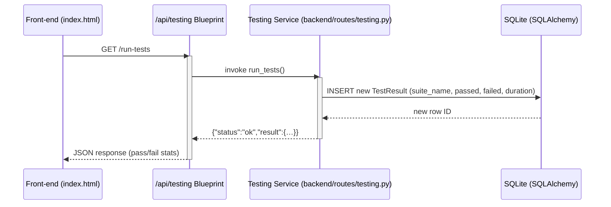

```mermaid
sequenceDiagram
    participant UI as Front‑end (index.html)
    participant API as /api/testing Blueprint
    participant Service as Testing Service (backend/routes/testing.py)
    participant DB as SQLite (SQLAlchemy)

    UI->>API: GET /run-tests
    activate API
    API->>Service: invoke run_tests()
    activate Service
    Service->>DB: INSERT new TestResult (suite_name, passed, failed, duration)
    DB-->>Service: new row ID
    Service-->>API: {"status":"ok","result":{…}}
    deactivate Service
    API-->>UI: JSON response (pass/fail stats)
    deactivate API
```
